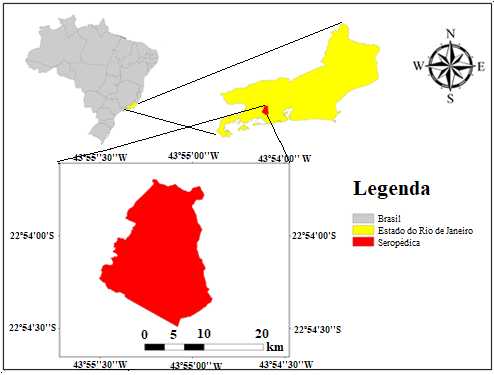
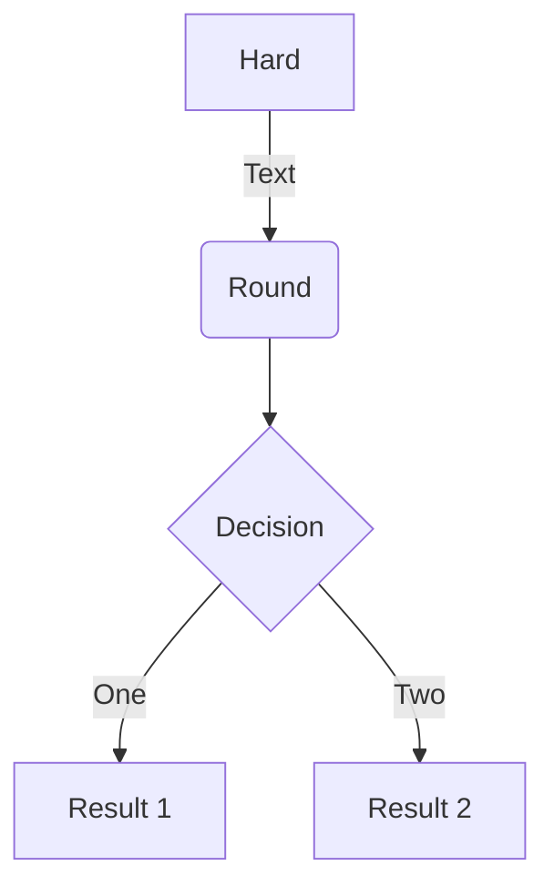
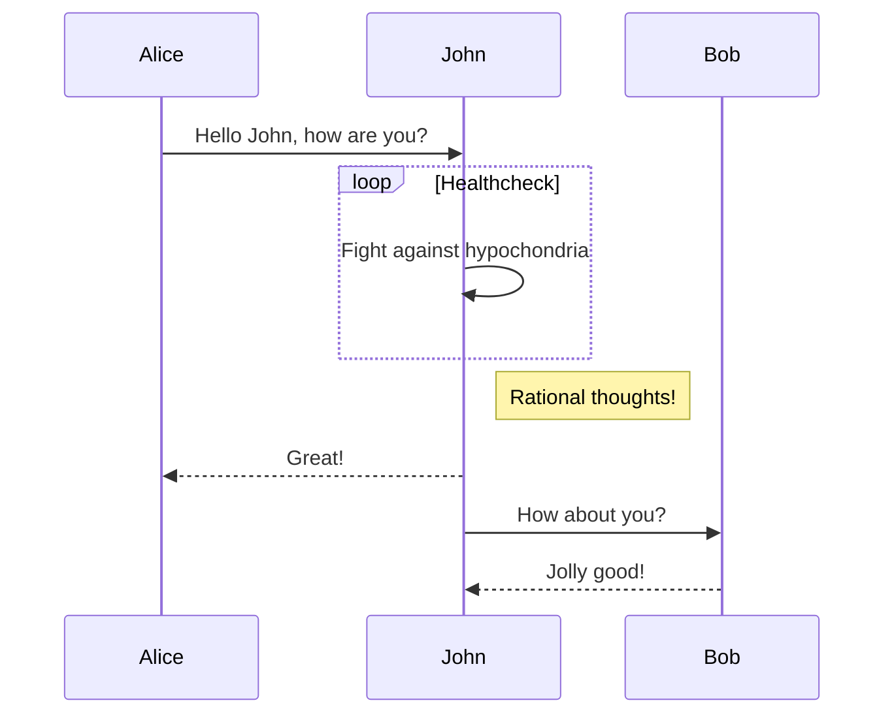
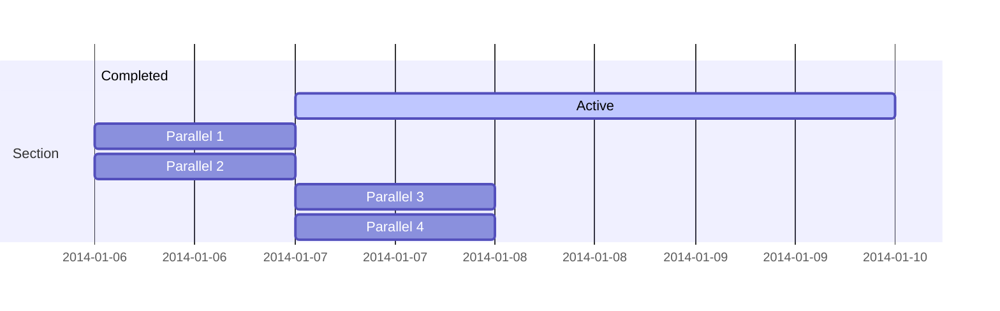
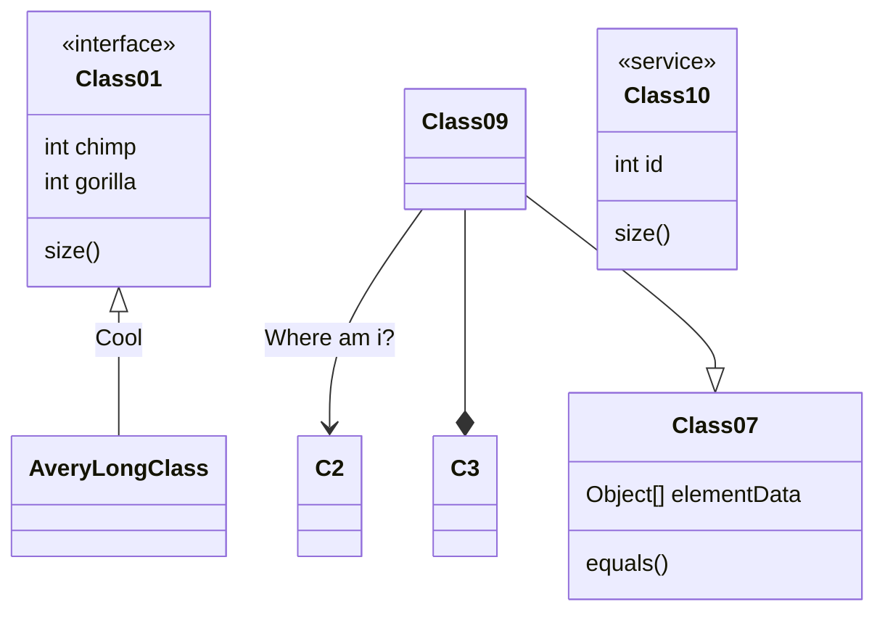
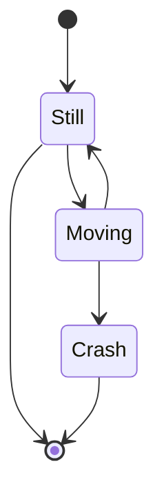

```{r, eval=FALSE, echo=FALSE}
rmarkdown::render('index.Rmd', encoding = 'UTF-8'")
```

# Introdução
## Conceitos básicos e terminologias
A *amostragem* diz respeito à seleção de um subconjunto de indivíduos de uma população para estimar características de toda a população [@Wang2012a]. Ou A amostragem pode ser definida como selecção de partes de um universo finito, com a proposta de obter informações desse universo [@deGruijter2006]. A *amostra* pode ser definida como a parte coletada, e levada para laboratório, ou observada *in situ*.  E uma única parte dessa amostra pode ser  definida como *unidade amostral*, o número de unidades amostrais é definido como *tamanho amostral* ou *n amostral* [@deGruijter2006]. 
Uma confusão comum na literatura é sobre a definição de amostragem aletória e amostragem arbitrária ou casual [@Brus2019] no segundo caso os locais de amostragem são escolhidos, fundamentalmente, em função da subjetividade da pessoa conduzindo o ntraballho. Para evitar a confusão o termo *amostragem probabilística* deve ser priorizado para o as amostras aleatórias. A amostragem de probabilidade é uma amostragem aleatória que atende a dois requisitos. Em primeiro lugar, todas as unidades da população têm uma probabilidade positiva de serem selecionadas. Nenhuma parte da população pode ser excluída. Em segundo lugar, a probabilidade de seleção de cada amostra possível é conhecida. Com amostragem arbitrária (casual), esses dois requisitos geralmente não são atendidos [@Brus2019].


## Amostragem no mapeamento convencional de solos
No caso do mapeamento convencional de solos, o método de prospecção e a frequência de amostragem dependem do nível de detalhe do levantamento e do objetivo do levantamento [@IBGE2015]. Por exemplo, na terceira edição do Manual Técnico de Pedologia [@IBGE2015] o método de prospecção indicado para levantamento exploratório é o de extrapolação, generalizações, correlações e poucas observações de campo, com uma frequência de amostragem de um perfil completo por classe de solo predominante na associação. Para o levantamento semidetalhado a densidade de observações e a frequência de amostragem são calculadas em função da heterogeneidade da área e da facilidade de correlação de solos e a superfície geomorfológicas. No entanto, é recomendada uma média de 0,002 a 0,20 observações por hectare e um perfil completo e um complementar por classe de solo componente da unidade de mapeamento simples ou associação. 
Porém para o MDS esse esquema de amostragem não se aplica, pois não fornece estimativa estatística representativa. No MDS é necessário o uso de estratégias de amostragem estatisticamente robustas para diminuir a subjetividade e consequentemente os possíveis erros na predição [@Minasny2007b]

## Amostragem no mapeamento digital de solos
No caso do mapeamento digital de solos (MDS) a amostragem é um fator crucial, pois pode contribuir para elevar ou diminuir os custos do levantamento de solos. Ainda é considera uma das etapas mais importantes para o MDS [@CarvalhoJunior2014]. Para o MDS, para uma otimização da calibração de modelos matemáticos as amostras coletadas devem representar ao máximo a distribuição espacial do que está sendo modelado (atributo ou classe de solo), por isso técnicas como o Hipercubo Latino Condicionado (cLHS) [@Minasny2006] são frequentemente usados nessa etapa e para essa finalidade. Esse tipo de amostragem é conhecido como amostragem não probabilística e será abordado com mais detalhes nos exemplos. 
Para validação dos resultados das predições espaciais no MDS o tipo de abordagem recomendado é a amostragem probabilística [@BrusEtAl2011], esse tipo de amostragem busca a imparcialidade e diminuição de viés para validação dos produtos do mapeamento.  Atenção especial deve ser tomada nessa etapa, pois nem sempre é possível uma amostragem completamente probabilística (aleatória). Há então a necessidade de encontrar a condição perfeita do que é factível e o ideal. Exemplos de amostragem probabilística serão abordados com mais detalhe nos exemplos.  
Parte do material aqui desenvolvido foi extraído e adaptado do livro em desenvolvimento de Alessandro Samuel-Rosa, [pedometria feita simples](http://samuel-rosa.github.io/pedometria-feita-simples/principios-da-amostragem-espacial.html). O capítulo 7 do livro trata de princípios da amostragem espacial. Também foram extraídas informações a respeito de amostragem para validação de mapas digitais de solos [@BrusEtAl2011] e amostragem para mapeamento de solos [@Brus2019]. Assim objetivo desse tutorial e compilar as informações dos trabalhos mencionados para simular difentes estratégias amostrais para dar suporte aos levantamentos de solos com foco em MDS e avaliação dos produtos gerados. 


# Área experimental e base dados
## Área experimental
Ao longo desse tutorial sobre amostragem, você verá exemplos de cada tipo de amostragem implementados no R usando o conjunto de dados de um área experimental localizada no município de Seropédica, estado do Rio de Janeiro, Brasil, nas coordenadas geográficas centrais aproximadas 22º54’00” S e  43º55’00” W (Figura \@ref(fig:localizacao1)). 
```{r localizacao1, echo=FALSE,message=FALSE, warning=FALSE, fig.cap= "Mapa de localização do município de Seropédica-RJ. Fonte: Nascimento (2019)",fig.align='center', dpi=80, fig.asp=1}

```

Especificamente, o trabalho foi desenvolvido na Fazendinha Agroecológica km 47 (Sistema Integrado de Produção Agroecológica - SIPA), associada à Embrapa Agrobiologia, Empresa de Pesquisa Agropecuária do Estado do Rio de Janeiro (Pesagro-Rio) e Universidade Federal Rural do Rio de Janeiro, nas coordenadas geográficas centrais aproximadas 22º45’0” S e 43º40’30” W (Figura \@ref(fig:localizacao2)). 
```{r localizacao2, echo=FALSE,message=FALSE, warning=FALSE, fig.cap= "Mapa de localização da área de estudo em Seropédica-RJ. Fonte: Nascimento (2019)",fig.align='center', dpi=120, fig.asp=1}
knitr::include_graphics("localizacao2.png")
```

O clima do município caracteriza-se por ser do tipo Aw (Tropical com inverno seco), segundo a classificação de Köppen. Seropédica tem uma temperatura média de 23,5 °C e uma pluviosidade média anual de 1354 mm. Os maiores valores de precipitação são verificados nos meses de novembro a janeiro e os menores no período entre maio e agosto [@Oliveira-J2014]. A área dos exemplos encontra-se ocupada por pastagem e caracteriza-se por apresentar relevo suave-ondulado a ondulado, altitude entre 17 a 50 m sobre o nível do mar, e ausência de rochosidade e pedregosidade em superfície [@Nascimento2019].

Os Solos da área experimental são caraterizados por apresentar, no geral baixa fertilidade e elevado grau de desonvilvimento com fatores e processos de formação específicos e dominates para cada ordem e posição da paisagem. Para o trabalho de onde os dados derivam [@Nascimento2019], foram abertas 10 trincheiras em diferentes pontos da paisagem, onde foram descritos e classificados perfis do solo, sendo uma trincheira no topo (P10), duas na posição de terço médio (P3 e P9), uma no terço inferior (P8), três no sopé da vertente (P2, P5 e P7) e três na área de baixada (P1, P4 e P6). Os solos froam classificados respectivamente como Argissolos Vermelhos P10, P9 e P3; Argissolo Amarelo, P8; Planossolos Háplicos (arênicos e espessarenicos), P7,P2,P5; Planossolos Háplicos (gleissólicos), P4, P6 e Cambissolo Hálico (com evidente processos de gleização) P1 (Figura \@ref(fig:localizacao2)). 

## Base de dados (Covariáveis ambientais)
As covariáveis ambientais para modelar as propriedades do solo foram derivadas de duas fontes de dados: modelo digital de elevação, dados de sensoriamento remoto (imagem orbital), uma imagem RapidEye. Elas foram escolhidos para descrever os principais fatores formadores do solo, de acordo com a abordagem scorpan [@McBratneyEtAl2003].

*Modelo Digital de Elevação (MDE)*: O MDE utilizado, com resolução espacial de 2 m, foi gerado a partir das curvas de nível e pontos cotados coeletados com gps geodésico. Do MDE foram derivados 12 atributos de terreno com pontencial uso para modelagem no MDS. 

*Imagem de satélite*: foram utilizadas duas cenas do sensor RapidEyeambas de 2011. As duas cenas foram usadas para cobrir toda a área de estudo e eles têm uma 12 resolução radiométrica de bits, resolução espacial de 6,5m, e ortorretificadas para resolução espacial de 5m [@RapidEye2012].
Das cenas foram derivados os indices de vegetação (NDVI, inglês) e índice de vegetação ajustado ao solo (SAVI, inglês).

## Áreas ambientalmente homogêneas (Estratos)
Para fazer o exerício foram criadas áreas ambientalmente similares (homogêneas), essa a bordagem é indicada em casos onde há por exemplo o interesse de fazer a amostragem po estratos. Nesse execício optou-se por criar 10 estratos usando as variáveis, que julgamos serem as mais representativas para discretizar os ambientes. Foram elas elevação, declividade e SAVI. Para fazer o agrupamento da áreas de maior similaridade (criação de clusters) foi utilizado o algorítimo de classificação não supervisionada *K-Means Clustering* que visa particionar os pontos em k grupos de forma que a soma dos quadrados dos pontos aos centros de cluster designados seja minimizada. No mínimo, todos os centros do cluster estão na média dos seus conjuntos de Voronoi (o conjunto de pontos de dados que estão mais próximos do centro do cluster).


Academic is designed to give technical content creators a seamless experience. You can focus on the content and Academic handles the rest.

**Highlight your code snippets, take notes on math classes, and draw diagrams from textual representation.**

On this page, you'll find some examples of the types of technical content that can be rendered with Academic.

## Examples

### Code
A *amostragem* diz respeito à seleção de um subconjunto de indivíduos de uma população para estimar características de toda a população @Wang2012a
Academic supports a Markdown extension for highlighting code syntax. You can enable this feature by toggling the `highlight` option in your `config/_default/params.toml` file.

    ```python
    import pandas as pd
    data = pd.read_csv("data.csv")
    data.head()
    ```

renders as

```python
import pandas as pd
data = pd.read_csv("data.csv")
data.head()
```

### Math

Academic supports a Markdown extension for $\LaTeX$ math. You can enable this feature by toggling the `math` option in your `config/_default/params.toml` file.

To render *inline* or *block* math, wrap your LaTeX math with `$...$` or `$$...$$`, respectively.

Example **math block**:

```tex
$$\gamma_{n} = \frac{ 
\left | \left (\mathbf x_{n} - \mathbf x_{n-1} \right )^T 
\left [\nabla F (\mathbf x_{n}) - \nabla F (\mathbf x_{n-1}) \right ] \right |}
{\left \|\nabla F(\mathbf{x}_{n}) - \nabla F(\mathbf{x}_{n-1}) \right \|^2}$$
```

renders as

$$\gamma_{n} = \frac{ \left | \left (\mathbf x_{n} - \mathbf x_{n-1} \right )^T \left [\nabla F (\mathbf x_{n}) - \nabla F (\mathbf x_{n-1}) \right ] \right |}{\left \|\nabla F(\mathbf{x}_{n}) - \nabla F(\mathbf{x}_{n-1}) \right \|^2}$$

Example **inline math** `$\nabla F(\mathbf{x}_{n})$` renders as $\nabla F(\mathbf{x}_{n})$.

Example **multi-line math** using the `\\\\` math linebreak:

```tex
$$f(k;p_0^*) = \begin{cases} p_0^* & \text{if }k=1, \\\\
1-p_0^* & \text {if }k=0.\end{cases}$$
```

renders as

$$f(k;p_0^*) = \begin{cases} p_0^* & \text{if }k=1, \\\\
1-p_0^* & \text {if }k=0.\end{cases}$$

### Diagrams

Academic supports a Markdown extension for diagrams. You can enable this feature by toggling the `diagram` option in your `config/_default/params.toml` file or by adding `diagram: true` to your page front matter.

An example **flowchart**:

    ```mermaid
    graph TD
    A[Hard] -->|Text| B(Round)
    B --> C{Decision}
    C -->|One| D[Result 1]
    C -->|Two| E[Result 2]
    ```

renders as



An example **sequence diagram**:

    ```mermaid
    sequenceDiagram
    Alice->>John: Hello John, how are you?
    loop Healthcheck
        John->>John: Fight against hypochondria
    end
    Note right of John: Rational thoughts!
    John-->>Alice: Great!
    John->>Bob: How about you?
    Bob-->>John: Jolly good!
    ```

renders as



An example **Gantt diagram**:

    ```mermaid
    gantt
    section Section
    Completed :done,    des1, 2014-01-06,2014-01-08
    Active        :active,  des2, 2014-01-07, 3d
    Parallel 1   :         des3, after des1, 1d
    Parallel 2   :         des4, after des1, 1d
    Parallel 3   :         des5, after des3, 1d
    Parallel 4   :         des6, after des4, 1d
    ```

renders as



An example **class diagram**:

    ```mermaid
    classDiagram
    Class01 <|-- AveryLongClass : Cool
    <<interface>> Class01
    Class09 --> C2 : Where am i?
    Class09 --* C3
    Class09 --|> Class07
    Class07 : equals()
    Class07 : Object[] elementData
    Class01 : size()
    Class01 : int chimp
    Class01 : int gorilla
    class Class10 {
      <<service>>
      int id
      size()
    }
    ```

renders as



An example **state diagram**:

    ```mermaid
    stateDiagram
    [*] --> Still
    Still --> [*]
    Still --> Moving
    Moving --> Still
    Moving --> Crash
    Crash --> [*]
    ```

renders as



### Todo lists

You can even write your todo lists in Academic too:

```markdown
- [x] Write math example
- [x] Write diagram example
- [ ] Do something else
```

renders as

- [x] Write math example
- [x] Write diagram example
- [ ] Do something else

### Tables

Represent your data in tables:

```markdown
| First Header  | Second Header |
| ------------- | ------------- |
| Content Cell  | Content Cell  |
| Content Cell  | Content Cell  |
```

renders as

| First Header  | Second Header |
| ------------- | ------------- |
| Content Cell  | Content Cell  |
| Content Cell  | Content Cell  |

### Asides

Academic supports a [shortcode for asides](https://sourcethemes.com/academic/docs/writing-markdown-latex/#alerts), also referred to as *notices*, *hints*, or *alerts*. By wrapping a paragraph in `{} ... {}`, it will render as an aside.

```markdown
{}
A Markdown aside is useful for displaying notices, hints, or definitions to your readers.
{}
```

renders as

{}
A Markdown aside is useful for displaying notices, hints, or definitions to your readers.
{}

### Icons

Academic enables you to use a wide range of [icons from _Font Awesome_ and _Academicons_](https://sourcethemes.com/academic/docs/page-builder/#icons) in addition to [emojis](https://sourcethemes.com/academic/docs/writing-markdown-latex/#emojis).

Here are some examples using the `icon` shortcode to render icons:

```markdown
 Terminal  
 Python  
 R
```

renders as

 Terminal  
 Python  
 R

### Did you find this page helpful? Consider sharing it 🙌

# Referências
